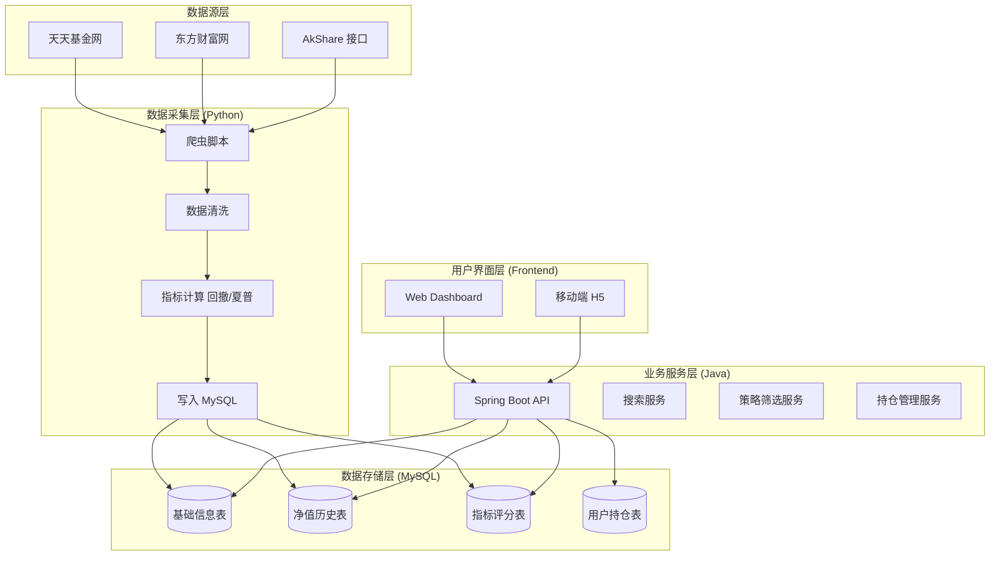

# 基金辅助交易决策系统设计文档 (v1.0)

## 1. 项目概述

### 1.1 项目背景

旨在构建一套个人专用的基金交易辅助决策系统，解决个人投资者在基金交易中面临的数据分散、决策情绪化、回测困难等痛点。系统通过自动化数据采集、量化策略分析和可视化展示，辅助用户进行理性的投资决策。

### 1.2 建设目标

1. **数据自动化**：自动抓取全市场基金净值、持仓、估值等数据。
2. **决策量化**：建立基金评分模型，筛选“优质基金”，提供买卖信号参考。
3. **账户管理**：记录个人持仓，计算真实收益率，支持策略回测。
4. **技术架构**：采用 Python (数据采集) + Java (业务服务) + MySQL (存储) 的混合架构，兼顾开发效率与系统稳定性。

### 1.3 适用范围

- **用户群体**：个人自用（非商业化）。
- **交易品种**：主要支持公募开放式基金（含 ETF 联接）。

## 2. 系统架构设计

### 2.1 技术栈选型

| 模块               | 技术选型                  | 说明                                                      |
| :----------------- | :------------------------ | :-------------------------------------------------------- |
| **数据采集 (ETL)** | **Python 3.9+**           | 利用 `AkShare`, `Pandas`, `Requests` 进行数据抓取与清洗。 |
| **后端服务**       | **Java 17 + Spring Boot** | 提供 RESTful API，处理业务逻辑、用户鉴权、复杂查询。      |
| **数据库**         | **MySQL 8.0**             | 持久化存储结构化数据，字符集 `utf8mb4`。                  |
| **前端展示**       | **Vue 3 + ECharts**       | 数据可视化、仪表盘、交互界面。                            |
| **任务调度**       | **Crontab / Docker**      | 定时触发 Python 爬虫脚本。                                |
| **部署方式**       | **Docker Compose**        | 容器化部署，隔离环境，便于迁移。                          |

### 2.2 逻辑架构图



### 2.3 数据流转机制 (Python & Java 协作)

采用**“数据库即接口”**的解耦模式，避免复杂的 RPC 调用。

1. 写操作 (Python)

   ：

   - Python 脚本每日 18:00 运行。
   - 抓取数据后，先写入 `tmp_` 开头的临时表。
   - 校验数据完整性（如非空、格式正确）。
   - 通过 `REPLACE INTO` 或 `INSERT ON DUPLICATE KEY UPDATE` 合并至正式表。
   - 更新 `data_update_log` 表，标记状态为 `SUCCESS`。

2. 读操作 (Java)

   ：

   - Java 接口查询时，仅读取状态为 `SUCCESS` 的数据。
   - 复杂指标（如最大回撤）直接读取 Python 预计算好的结果表，不进行实时计算，保证响应速度。

## 3. 数据库设计 (MySQL)

### 3.1 设计规范

- **字符集**：`utf8mb4` (支持生僻字)。
- **金额/净值**：统一使用 `DECIMAL(20, 4)`，禁止使用 `FLOAT/DOUBLE`。
- **时间**：统一使用 `DATETIME`，时区 `Asia/Shanghai`。
- **索引**：基金代码 (`fund_code`) 和 日期 (`trade_date`) 必须建立联合唯一索引。

### 3.2 核心表结构

#### 3.2.1 基金基础信息表 (`t_fund_basic`)

存储基金静态信息，更新频率低。

```sql
CREATE TABLE `t_fund_basic` (
  `fund_code` VARCHAR(10) NOT NULL COMMENT '基金代码',
  `fund_name` VARCHAR(100) NOT NULL COMMENT '基金名称',
  `fund_type` VARCHAR(50) COMMENT '类型 (股票/混合/债券)',
  `manager_name` VARCHAR(50) COMMENT '基金经理',
  `manager_start_date` DATE COMMENT '经理任职起始日',
  `scale_amount` DECIMAL(20, 2) COMMENT '基金规模 (亿元)',
  `establish_date` DATE COMMENT '成立日期',
  `company_name` VARCHAR(100) COMMENT '基金公司',
  `update_time` DATETIME DEFAULT CURRENT_TIMESTAMP ON UPDATE CURRENT_TIMESTAMP,
  PRIMARY KEY (`fund_code`)
) ENGINE=InnoDB DEFAULT CHARSET=utf8mb4;
```

#### 3.2.2 基金净值历史表 (`t_fund_nav`)

存储每日净值，数据量最大。

```sql
CREATE TABLE `t_fund_nav` (
  `id` BIGINT AUTO_INCREMENT PRIMARY KEY,
  `fund_code` VARCHAR(10) NOT NULL,
  `trade_date` DATE NOT NULL COMMENT '交易日期',
  `unit_nav` DECIMAL(20, 4) NOT NULL COMMENT '单位净值',
  `accumulated_nav` DECIMAL(20, 4) NOT NULL COMMENT '累计净值',
  `daily_growth` DECIMAL(10, 4) COMMENT '日增长率 (%)',
  `dividend` DECIMAL(20, 4) DEFAULT 0 COMMENT '分红金额',
  UNIQUE KEY `uk_code_date` (`fund_code`, `trade_date`),
  INDEX `idx_date` (`trade_date`)
) ENGINE=InnoDB DEFAULT CHARSET=utf8mb4;
```

#### 3.2.3 基金指标评分表 (`t_fund_indicator`)

由 Python 每日计算后写入，Java 直接读取用于筛选。

```sql
CREATE TABLE `t_fund_indicator` (
  `fund_code` VARCHAR(10) NOT NULL,
  `calc_date` DATE NOT NULL COMMENT '计算日期',
  `return_1y` DECIMAL(10, 4) COMMENT '近 1 年收益率 (%)',
  `return_3y` DECIMAL(10, 4) COMMENT '近 3 年收益率 (%)',
  `max_drawdown` DECIMAL(10, 4) COMMENT '历史最大回撤 (%)',
  `sharpe_ratio` DECIMAL(10, 4) COMMENT '夏普比率',
  `volatility` DECIMAL(10, 4) COMMENT '波动率',
  `quality_score` INT COMMENT '综合评分 (0-100)',
  `rating_level` VARCHAR(10) COMMENT '评级 (S/A/B/C)',
  PRIMARY KEY (`fund_code`, `calc_date`)
) ENGINE=InnoDB DEFAULT CHARSET=utf8mb4;
```

#### 3.2.4 用户持仓记录表 (`t_user_portfolio`)

记录用户的买卖操作。

```sql
CREATE TABLE `t_user_portfolio` (
  `id` BIGINT AUTO_INCREMENT PRIMARY KEY,
  `fund_code` VARCHAR(10) NOT NULL,
  `trade_type` TINYINT COMMENT '1:买入，2:卖出',
  `trade_date` DATETIME NOT NULL,
  `nav_price` DECIMAL(20, 4) NOT NULL COMMENT '成交净值',
  `shares` DECIMAL(20, 2) NOT NULL COMMENT '份额',
  `amount` DECIMAL(20, 2) NOT NULL COMMENT '金额',
  `fee` DECIMAL(20, 2) COMMENT '手续费',
  `create_time` DATETIME DEFAULT CURRENT_TIMESTAMP
) ENGINE=InnoDB DEFAULT CHARSET=utf8mb4;
```

## 4. 核心功能模块设计

### 4.1 数据采集模块 (Python)

- **输入**：全市场基金代码列表。

- 处理

  ：

  1. 调用 `akshare.fund_open_fund_info_em` 获取净值。
  2. 调用 `akshare.fund_portfolio_hold_em` 获取持仓（季度更新）。
  3. 使用 `Pandas` 计算技术指标（MA20, MA60）和统计指标（回撤、夏普）。

- **输出**：写入 MySQL `t_fund_nav` 和 `t_fund_indicator`。

- **容错**：单次请求失败重试 3 次，整体失败发送钉钉/邮件报警。

### 4.2 优质基金检索模块 (策略引擎)

- **逻辑**：基于 `t_fund_indicator` 表进行多条件筛选。

- 评分模型 (示例)

  ：

  - **收益 (40 分)**：近 1 年收益 > 15% (20 分), 近 3 年收益 > 10% (20 分)。
  - **风险 (30 分)**：最大回撤 > -20% (15 分), 夏普比率 > 1.0 (15 分)。
  - **规模 (10 分)**：2 亿 < 规模 < 50 亿 (10 分)。
  - **经理 (10 分)**：任职 > 3 年 (10 分)。
  - **评级 (10 分)**：晨星 4 星以上 (10 分)。

- **接口**：`GET /api/fund/screen?min_score=80&type=stock`

### 4.3 基金搜索模块

- **功能**：支持代码、名称、拼音首字母搜索。

- 优化

  ：

  - 在 `t_fund_basic` 表增加 `name_pinyin` 字段（如“招商” -> "zs"）。
  - Java 层使用 `LIKE '%keyword%'` 匹配代码、名称和拼音。

- **接口**：`GET /api/fund/search?keyword=000`

### 4.4 交易信号与提醒

- 逻辑

  ：每日 Python 计算完成后，检查是否触发阈值。

  - 例：某基金估值分位 < 10% -> 触发“低估买入”信号。
  - 例：某基金持仓收益 > 20% -> 触发“止盈提醒”。

- **通知**：调用微信推送 API 或 邮件 SMTP 发送通知。

## 5. 接口设计 (Java Spring Boot)

### 5.1 统一响应格式

```json
{
  "code": 200,
  "message": "success",
  "data": { ... }
}
```

### 5.2 核心 API 列表


| 方法 | 路径                      | 描述                   | 参数示例                  |
| :--- | :------------------------ | :--------------------- | :------------------------ |
| GET  | `/api/fund/detail/{code}` | 获取基金详情及最新净值 | `code=000001`             |
| GET  | `/api/fund/nav/history`   | 获取历史净值曲线       | `code=000001&days=365`    |
| GET  | `/api/fund/screen`        | 筛选优质基金           | `min_score=80&page=1`     |
| GET  | `/api/fund/search`        | 搜索基金               | `keyword=招商`            |
| POST | `/api/portfolio/record`   | 录入交易记录           | `{code, type, amount...}` |
| GET  | `/api/portfolio/analysis` | 持仓收益分析           | -                         |

## 6. 部署与运维方案

### 6.1 环境准备

- 服务器：本地 NAS 或 云服务器 (2C4G 即可)。
- 软件：Docker, Docker Compose, Git。

### 6.2 Docker Compose 配置 (`docker-compose.yml`)

```yaml
version: '3.8'
services:
  mysql:
    image: mysql:8.0
    environment:
      MYSQL_ROOT_PASSWORD: ${DB_PASS}
      MYSQL_DATABASE: fund_db
    volumes:
      - ./data/mysql:/var/lib/mysql
    ports:
      - "3306:3306"
    networks:
      - fund_net

  python-etl:
    build: ./python_etl
    command: python main.py  # 实际生产建议配置 cron
    environment:
      - DB_HOST=mysql
      - DB_PASS=${DB_PASS}
    depends_on:
      - mysql
    networks:
      - fund_net

  java-backend:
    build: ./java_backend
    ports:
      - "8080:8080"
    environment:
      - SPRING_DATASOURCE_URL=jdbc:mysql://mysql:3306/fund_db
      - SPRING_DATASOURCE_PASSWORD=${DB_PASS}
    depends_on:
      - mysql
    networks:
      - fund_net

networks:
  fund_net:
    driver: bridge
```

### 6.3 定时任务策略

- **方案 A (简单)**：在宿主机配置 Crontab，每天 18:30 执行 `docker-compose run --rm python-etl`。
- **方案 B (进阶)**：在 Python 容器内安装 `supervisor` 或 `APScheduler`，常驻运行，内部调度。
- **建议**：自用系统推荐 **方案 A**，便于查看日志和管理。

## 7. 风险评估与应对


| 风险项           | 风险描述                     | 应对策略                                                     |
| :--------------- | :--------------------------- | :----------------------------------------------------------- |
| **数据准确性**   | 爬虫源网站改版或数据错误     | 1. 多源校验 (天天基金 + 东方财富)。 2. 设置阈值报警 (如净值单日波动>10% 需人工确认)。 3. 使用 AkShare 社区维护版本。 |
| **净值估算误差** | 盘中估值与晚间实际净值偏差大 | 1. 界面显著标注“估值仅供参考”。 2. 交易信号仅基于**确认净值** (T+1 日) 或 收盘后信号。 |
| **合规风险**     | 被误认为非法荐股             | 1. 系统仅限个人登录使用。 2. 界面增加免责声明。 3. 不公开传播策略代码。 |
| **系统可用性**   | 爬虫脚本挂掉导致无数据       | 1. 配置心跳检测，数据超过 24 小时未更新发送报警。 2. Java 层做降级处理，显示旧数据并提示。 |
| **精度丢失**     | 金额计算出现分位误差         | 1. 数据库强制 `DECIMAL`。 2. Java 强制 `BigDecimal`。 3. 禁止使用浮点数运算。 |

## 8. 开发路线图 (Roadmap)

### 第一阶段：数据基建 (预计 2 周)

- 完成 MySQL 表结构设计与创建。
- 编写 Python 脚本，调通 AkShare 接口。
- 实现全量基金基础信息入库。
- 实现每日净值增量更新入库。

### 第二阶段：后端与搜索 (预计 2 周)

- 搭建 Spring Boot 项目，配置 MyBatis-Plus。
- 实现基金搜索 API (支持代码/名称/拼音)。
- 实现基金详情 API (含历史净值曲线数据)。
- 完成 Docker 容器化部署。

### 第三阶段：策略与筛选 (预计 3 周)

- Python 端增加指标计算逻辑 (回撤、夏普、评分)。
- Java 端实现筛选接口 (多条件组合查询)。
- 前端页面开发 (列表、详情页、图表)。

### 第四阶段：持仓与回测 (预计 3 周)

- 实现用户交易记录录入功能。
- 计算持仓盈亏、总收益率。
- 实现简单的策略回测功能 (模拟过去 3 年收益)。
- 配置定时任务与报警通知。

## 9. 附录：开发注意事项

1. **AkShare 版本**：AkShare 更新频繁，建议在 `requirements.txt` 中锁定版本，避免自动升级导致接口变动。
2. **基金分红**：计算收益率时，务必使用**累计净值**或**复权净值**，否则分红会导致净值下跌，误导策略。
3. **QDII 基金**：部分 QDII 基金净值更新滞后 (T+2)，代码中需区分基金类型处理时间戳。
4. **隐私安全**：数据库密码不要硬编码在代码中，使用环境变量或配置文件加载。